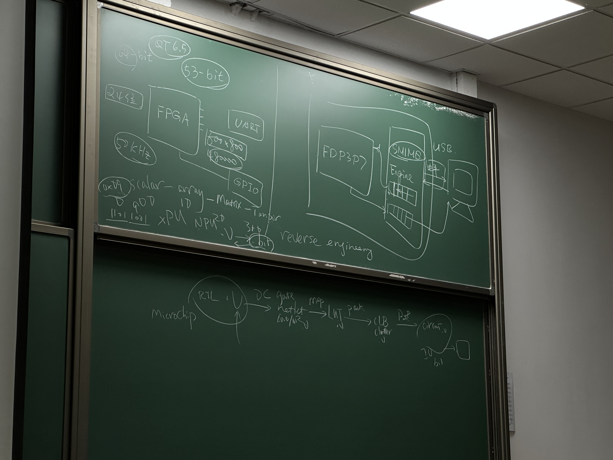
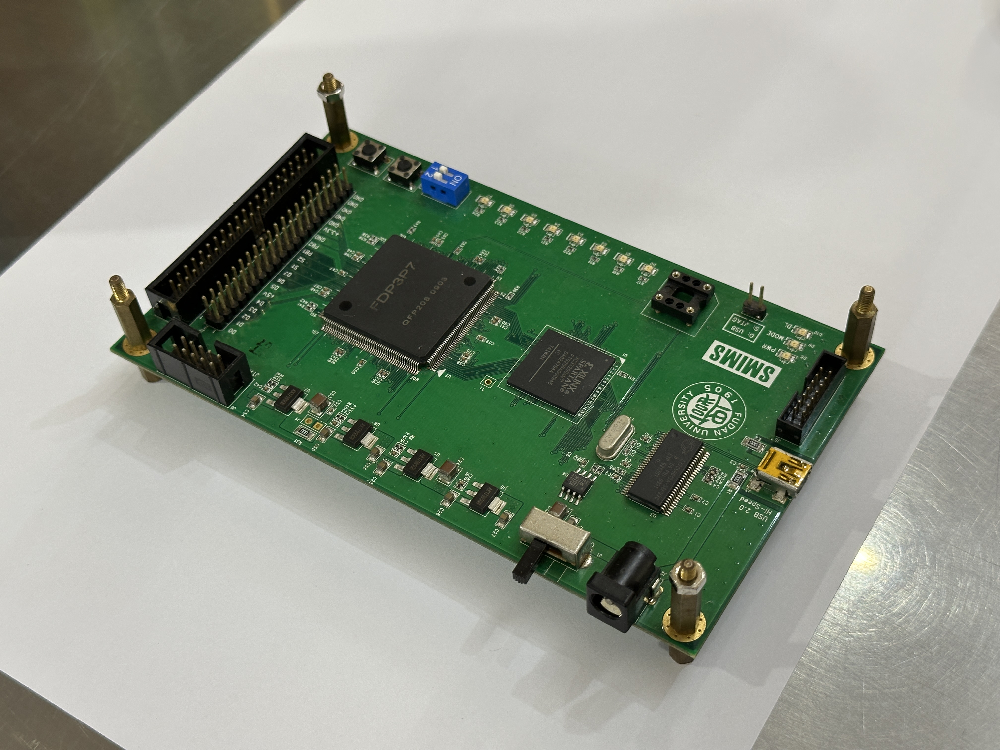

# FDE Overview

## Introduction

The FDE midterm project is a comprehensive experiment that encompasses the entire FPGA workflow, from writing RTL (Register Transfer Level) code to digital synthesis, from generating the gate file (an artifact of synthesis) to creating the bitstream, and finally, downloading the bitstream onto the FDP FPGA chip.

As a student with no background in microelectronics, all these workflows, tools, and concepts were initially foreign to me. The process of writing RTL code and performing logic synthesis to produce the gate-level code seemed daunting at first, as I had no understanding of what those terms even meant.

Throughout the course of working on this lab, I have gained significant insight into how FPGAs (or PLDs) operate—specifically their internal architectures, how they are “programmed,” and much more. In this "FDE" series, I have compiled my notes, experiments, takeaways, and documentation from this learning experience.

Also special thanks to 王伶俐老师！

<figure><figcaption>
A photo I took of the blackboard, during the second or third lecture, explaining the FDE workflow. At the time I still had no idea what it meant, or even what those things were.
</figcaption></figure>

***

## Images of the FDE board

<figure><figcaption>
FDE Board
</figcaption></figure> <figure><figcaption>
FDE Board (bird's eye view)
</figcaption></figure>

***

## Taking a closer look at the FDE board

Doing a rough inspection of the on-board components, we can observe the following **components**:

* [FDP3P7](fde-overview.md#fdp3p7)&#x20;
* [Xilinx Spartan XC3S200AN](fde-overview.md#xilinx-spartan)
* [Infineon CY7C68013A-56PVXC](fde-overview.md#infineon-cy7c68013a-56pvxc)
* [ATMEL542 IC](fde-overview.md#atmel542-ic)
* NSK 24.00 7G
  * This is the physical onboard 24.000MHz crystal that drives the Infineon USB controller
  * There is another 30MHz clock listed in the spec-sheet of the FPE board (on pin P185)
    * Unsure where this 30MHz clock comes from, maybe from a PLL?
* Some voltage regulators? (at the side)
* SMD capacitors and resistors
* GPIO, LEDs, buttons, PID switches, etc.

### What is [SMIMS](https://tw.smims.com.tw/)?

* 北瀚科技
* **S**mart, **M**ultiple, **I**ntegrated. **M**edia **S**ystems

> ​SMIMS Technology Corp., established in October 2004, is a **Taiwanese** company specializing in the development of hardware and software solutions for the semiconductor industry. They offer FPGA (Field-Programmable Gate Array) development platforms, such as VeriEnterprise, which integrate seamlessly with software environments like C++ and Matlab, and are particularly favored in multimedia and communications applications. Additionally, SMIMS has developed the VeriPrecision Indoor Location System (VILS), utilizing Ultra-Wideband (UWB) technology to achieve high-precision indoor positioning with an accuracy of ±20 cm. Their client base includes semiconductor design firms, integrated circuit manufacturers, and wafer fabs.
>
> \-- ChatGPT
>
> Source(s): [tw.smims.com.tw](https://tw.smims.com.tw/index.php?active=AboutUs\&utm_source=chatgpt.com)

### FDP3P7

The FDP3P7 chips were produced in 2009 and the FDE board itself was manufactored by SMIMS, a Taiwanese Company, in 2010. Since then, no more versions of the board were manufactored ever since.

### [Xilinx Spartan](https://chrome-extension/efaidnbmnnnibpcajpcglclefindmkaj/https://www.xilinx.com/publications/prod_mktg/pn002011.pdf)

A non-volitile FPGA, meaning that it would retain data, or its programming, even if power is lost. I assume that the core implementation of the SMIMS engine is on here as part of their intellectual property (or IP).

The SMIMS engine features the following capabilities:

* 2 1024x16 FIFOs (for bi-directional communication)
* FPGA Control
  * It allows the **programming** and **control** of FPGA hardware via USB & API protocols
* Writing to & reading from specific pins on the FDP FPGA
* Creating a "virtual" clock for the FPGA
* And more...

### [Infineon CY7C68013A-56PVXC](https://www.infineon.com/cms/en/product/universal-serial-bus/usb-2.0-peripheral-controllers/ez-usb-fx2lp-fx2g2-usb-2.0-peripheral-controller/cy7c68013a-56pvxc/)

> USB 2.0 Peripheral controller with 16K RAM, 24 GPIOs, 56-pin SSOP for non-battery powered applications

The following summary is provided courtesy of ChatGPT:

The CY7C68013A/CY7C68014A/CY7C68015A/CY7C68016A are high-speed USB microcontrollers from Infineon, part of the **EZ-USB** FX2LP family. These controllers are designed for applications requiring USB 2.0 interface functionality and come with a range of integrated features:

* USB 2.0 Support: The controllers are USB Hi-Speed certified and support both full-speed (12 Mbps) and high-speed (480 Mbps) data transfer, ideal for fast USB communication.
* Low Power Consumption: These microcontrollers operate with ultra-low power (no more than 85 mA) in any mode, making them suitable for bus-powered and battery-operated devices.
* Embedded Microprocessor: They feature an enhanced 8051 microprocessor, running at 12 MHz, 24 MHz, or 48 MHz, capable of handling various USB communication protocols efficiently.
* Memory: They include 16 KB of on-chip program/data RAM, plus additional features like multiple FIFO buffers for handling data transfer.
* Versatile Interface: The GPIF (General Programmable Interface) allows direct connection to parallel buses, supporting a variety of external interfaces, such as ATA, EPP, and PCMCIA.
* GPIO and Communication: The microcontrollers provide flexible GPIO pins, multiple USARTs for serial communication, and I2C support.
* Applications: They are used in various devices, including portable video recorders, modems, memory card readers, cameras, scanners, and more.

**Noteworthy Takeaways:**

* 4KB Bi-directional FIFO (8 or 16 bits wide):
  * Capable of up to 96 MBytes/s burst rate.
  * The fact that the USB interface IC features a 16-bit FIFO might explain why the SMIMS engine in FDE is also 16 bits wide—having matching data widths simplifies integration and data handling between the two components.
* 24 MHz Crystal Required:
  * This clarifies the purpose of the NSK 24.000 MHz crystal on the board, which is used to provide the required clock for the microcontroller.

### ATMEL542 IC

Not exactly sure what the ATMEL 542 IC is responsible for.

### Summary

From the USB port, there are multiple layers of abstraction—at least that’s how I perceive them. The first layer is the USB interface provided by the Infineon IC, which simplifies USB 2.0 communication by leveraging mature libraries like `libusb` (or any other similar USB library). After this USB abstraction layer, the contents of the USB's bi-directional FIFO are exchanged with the Xilinx FPGA, which likely contains the logic enabling communication with the FDP FPGA. This interface allows us to drive VeriComm input pins on the FPGA, read logic levels from the VeriComm output pins, and perform a variety of other functions. In other words, there are four key layers of abstraction from a high-level perspective:

1. The physical USB 2.0 port (micro-B)
2. The Infineon USB 2.0 interface controller IC
3. The Xilinx Spartan (SMIMS engine)
4. The FDP3P7 FPGA

***

## References


