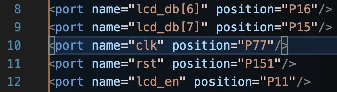

# FDE Tools & Documentation

To work with the FDE board, we mainly need two things:

* <mark style="color:green;">**Synopsys DC compiler**</mark>
  * **Highly recommended** to use an Intel x86 environment to run the DC virtual machine
  * Running the VM on a AMD processor might cause problems (no guarantee)
  * Also untested on Apple Silicon ARM CPUs (the VM performance would be terrible trying to emulate x86 architecture)
* <mark style="color:green;">**FDE workflow**</mark> (import, map, pack, place, route, etc.)&#x20;
  * The original FDE software is x86 Windows based
  * Modern version of FDE (UFDE+) is cross-platform compatible
    * Windows
    * MacOS (AARCH tested)
    * Linux (might has bugs?)
  * FDE-CLI (coming soon...)

***

## FDE Tools

As mentioned above,&#x20;

### Original FDE tools (windows) & DC compiler VM

> If you experience problems with the modern FDE tools, you can consider using the original FDE tools from 2019 or 2021.

### FDE Workflow

#### <mark style="color:orange;">UFDE+</mark> (Import, map, pack, place, route, generate bitstream, & program)

* Typescript & React frontend
* Rust backend (FDE tools via [FFI](https://en.wikipedia.org/wiki/Foreign_function_interface))
* Cross-platform



#### <mark style="color:orange;">Rabbit</mark> (GUI, virtual components)

* C++
* QT Framework
* Windows, MacOS



#### <mark style="color:orange;">FDE-CLI</mark> (CLI for debugging & interacting with FDE board with more advanced features)

* Rust
* SMIMS driver implemented in Rust
* Cross-platform



***

## Constraints

There are actually two types of IO ports on the FDE board: VeriComm & GPIO (general purpose IO)

VeriComm ports is what the SMIMS engine uses as input and outport ports for its SMIMS API. UFDE's constraints mapping & Rabbit's virtual components all depend on VeriComm ports because those are the only ports that the **SMIMS engine can write and read to**. SMIMS **cannot** write or read from other ports, such as GPIO.

VeriComm ports are also separated into two categories: input port and output ports. There roles are obvious, but keep in mind that it does not support inout ports. A port and only be strictly an input port or an output port.

Here is a chart of the SMIMS VeriComm input & output ports:

<table><thead><tr><th width="140.52734375">SMIMS INPUT</th><th>Physical Input</th><th>SMIMS OUTPUT</th><th>Physical Output</th></tr></thead><tbody><tr><td>clk</td><td>P77</td><td> </td><td> </td></tr><tr><td>input 0</td><td>P151</td><td>output 0</td><td>P7</td></tr><tr><td>input 1</td><td>P148</td><td>output 1</td><td>P6</td></tr><tr><td>input 2</td><td>P150</td><td>output 2</td><td>P5</td></tr><tr><td>input 3</td><td>P152</td><td>output 3</td><td>P4</td></tr><tr><td>input 4</td><td>P160</td><td>output 4</td><td>P9</td></tr><tr><td>input 5</td><td>P161</td><td>output 5</td><td>P8</td></tr><tr><td>input 6</td><td>P162</td><td>output 6</td><td>P16</td></tr><tr><td>input 7</td><td>P163</td><td>output 7</td><td>P15</td></tr><tr><td>input 8</td><td>P164</td><td>output 8</td><td>P11</td></tr><tr><td>input 9</td><td>P165</td><td>output 9</td><td>P10</td></tr><tr><td>input 10</td><td>P166</td><td>output 10</td><td>P20</td></tr><tr><td>input 11</td><td>P169</td><td>output 11</td><td>P18</td></tr><tr><td>input 12</td><td>P173</td><td>output 12</td><td>P17</td></tr><tr><td>input 13</td><td>P174</td><td>output 13</td><td>P22</td></tr><tr><td>input 14</td><td>P175</td><td>output 14</td><td>P21</td></tr><tr><td>input 15</td><td>P191</td><td>output 15</td><td>P23</td></tr><tr><td>input 16</td><td>P120</td><td>output 16</td><td>P44</td></tr><tr><td>input 17</td><td>P116</td><td>output 17</td><td>P45</td></tr><tr><td>input 18</td><td>P115</td><td>output 18</td><td>P46</td></tr><tr><td>input 19</td><td>P114</td><td>output 19</td><td>P43</td></tr><tr><td>input 20</td><td>P113</td><td>output 20</td><td>P40</td></tr><tr><td>input 21</td><td>P112</td><td>output 21</td><td>P41</td></tr><tr><td>input 22</td><td>P111</td><td>output 22</td><td>P42</td></tr><tr><td>input 23</td><td>P108</td><td>output 23</td><td>P33</td></tr><tr><td>input 24</td><td>P102</td><td>output 24</td><td>P34</td></tr><tr><td>input 25</td><td>P101</td><td>output 25</td><td>P35</td></tr><tr><td>input 26</td><td>P100</td><td>output 26</td><td>P36</td></tr><tr><td>input 27</td><td>P97</td><td>output 27</td><td>P30</td></tr><tr><td>input 28</td><td>P96</td><td>output 28</td><td>P31</td></tr><tr><td>input 29</td><td>P95</td><td>output 29</td><td>P24</td></tr><tr><td>input 30</td><td>P89</td><td>output 30</td><td>P27</td></tr><tr><td>input 31</td><td>P88</td><td>output 31</td><td>P29</td></tr><tr><td>input 32</td><td>P87</td><td>output 32</td><td>P110</td></tr><tr><td>input 33</td><td>P86</td><td>output 33</td><td>P109</td></tr><tr><td>input 34</td><td>P81</td><td>output 34</td><td>P99</td></tr><tr><td>input 35</td><td>P75</td><td>output 35</td><td>P98</td></tr><tr><td>input 36</td><td>P74</td><td>output 36</td><td>P94</td></tr><tr><td>input 37</td><td>P70</td><td>output 37</td><td>P93</td></tr><tr><td>input 38</td><td>P69</td><td>output 38</td><td>P84</td></tr><tr><td>input 39</td><td>P68</td><td>output 39</td><td>P83</td></tr><tr><td>input 40</td><td>P64</td><td>output 40</td><td>P82</td></tr><tr><td>input 41</td><td>P62</td><td>output 41</td><td>P73</td></tr><tr><td>input 42</td><td>P61</td><td>output 42</td><td>P71</td></tr><tr><td>input 43</td><td>P58</td><td>output 43</td><td>P63</td></tr><tr><td>input 44</td><td>P57</td><td>output 44</td><td>P60</td></tr><tr><td>input 45</td><td>P49</td><td>output 45</td><td>P59</td></tr><tr><td>input 46</td><td>P47</td><td>output 46</td><td>P56</td></tr><tr><td>input 47</td><td>P48</td><td>output 47</td><td>P55</td></tr><tr><td>input 48</td><td>P192</td><td>output 48</td><td>P167</td></tr><tr><td>input 49</td><td>P193</td><td>output 49</td><td>P168</td></tr><tr><td>input 50</td><td>P199</td><td>output 50</td><td>P176</td></tr><tr><td>input 51</td><td>P200</td><td>output 51</td><td>P187</td></tr><tr><td>input 52</td><td>P201</td><td>output 52</td><td>P189</td></tr><tr><td>input 53</td><td>P202</td><td>output 53</td><td>P194</td></tr></tbody></table>

For more detailed documentation of both VeriComm & GPIO ports, refer to excel spreadsheet attached below:


VeriComm ports & GPIO documentation


### Customizing your constraints file

The constraints file can be automatically generated by UFDE+, but you can also modify the generated constraints file by changing the port name or adding more ports depending on your needs as long as the file follows the XML syntax. The format should be quite straightforward so I will leave it to you to figure out how to create your own constraints file (hint: you only need to add, modify, or delete the \<port ...> element & its <mark style="color:yellow;">name</mark> & <mark style="color:yellow;">position</mark> attributes).

* The <mark style="color:yellow;">name attribute</mark> <mark style="color:red;">**MUST**</mark> match a port from your top module (it should match exactly and case sensitive too)
* The <mark style="color:yellow;">position attribute</mark> also <mark style="color:red;">**MUST**</mark> match a physical port from the VeriComm documentation
  * The position attribute determines two things:
    * Input or output
    * The physical pin on the FPGA
  * <mark style="color:yellow;">Note: the position attribute can also be a</mark> <mark style="color:yellow;"></mark>_<mark style="color:yellow;">**GPIO pin**</mark>_ <mark style="color:yellow;"></mark><mark style="color:yellow;">if you wish to explore the unknown</mark>

***

## Clocks

The FDE board actually has two onboard clocks:

* A virtual clock generated by the SMIMS engine (P77)
* A internal 30MHz clock (P185)

By default, UFDE+ only supports P77 in the constraints config and generation. But if you wish to use the internal clock, you can modify the position of the "clk" port in your constraints file to P185.

<figure><figcaption>
P77 — Using SMIMS clock
</figcaption></figure> <figure><figcaption>
P185 — Using 30MHz clock
</figcaption></figure>

> NOTE: Using the 30MHz clock to drive the FPGA, you will have to manage cross-clock domain data sharing because the SMIMS engine will be running at a different frequency than the internal clock, the engine is not in sync with the FPGA when writing to & sampling from the input and output pins (it would be a magnitude of times slower). You might have to consider using an <mark style="color:green;">**asynchronous FIFO**</mark>.

***

## Common problems

