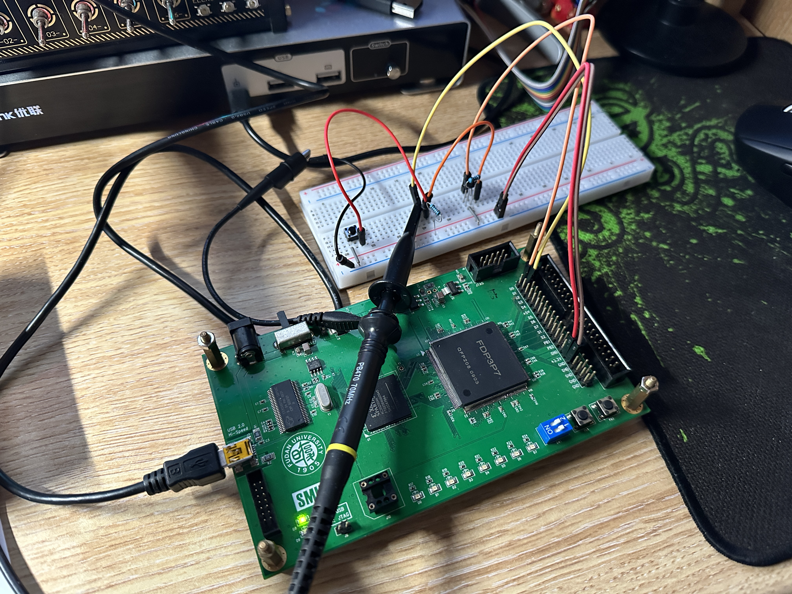
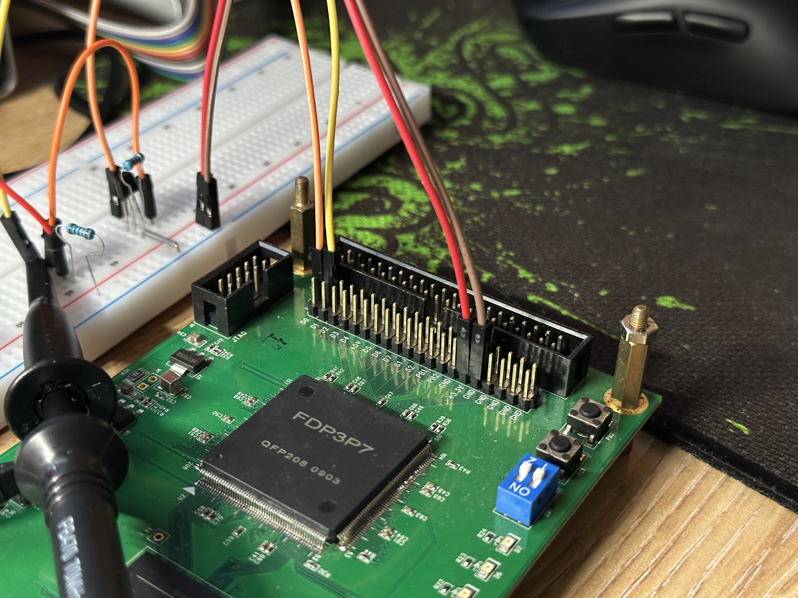
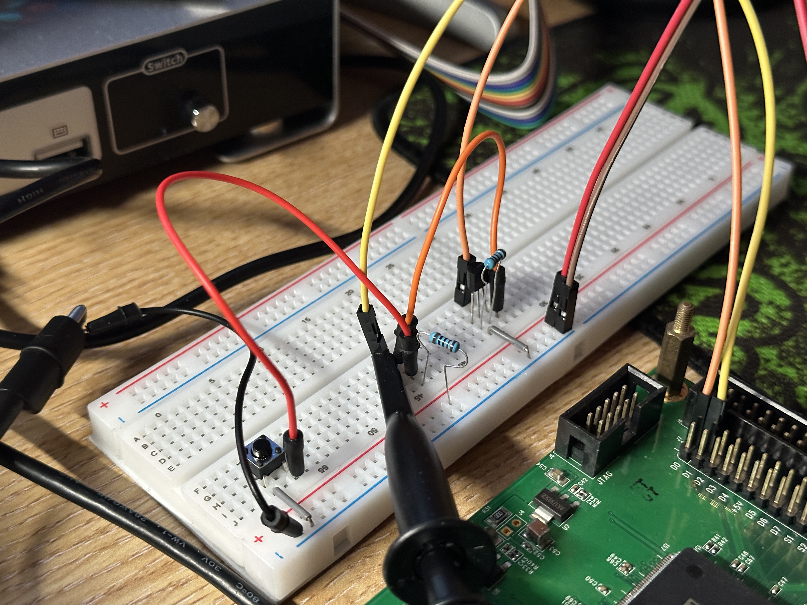
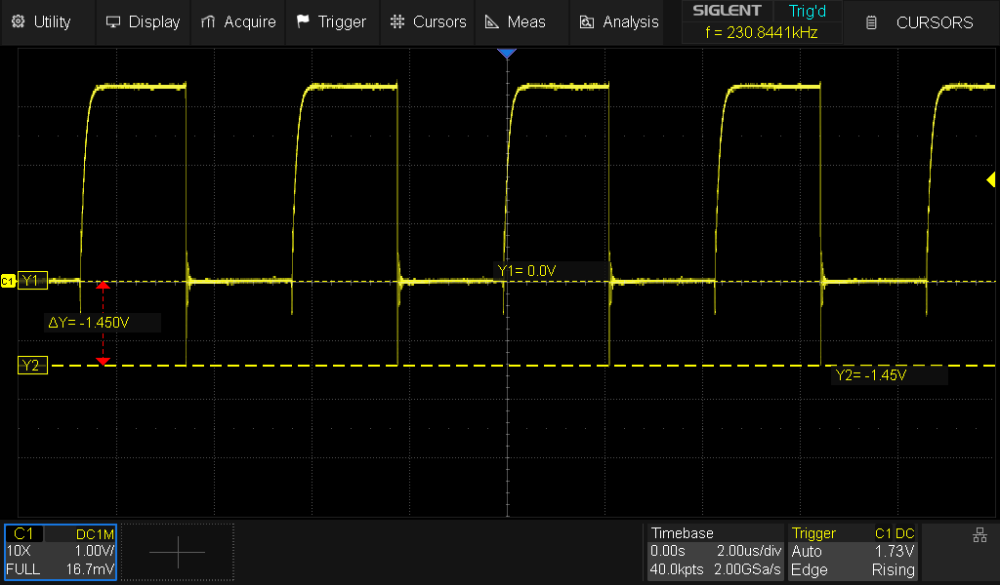
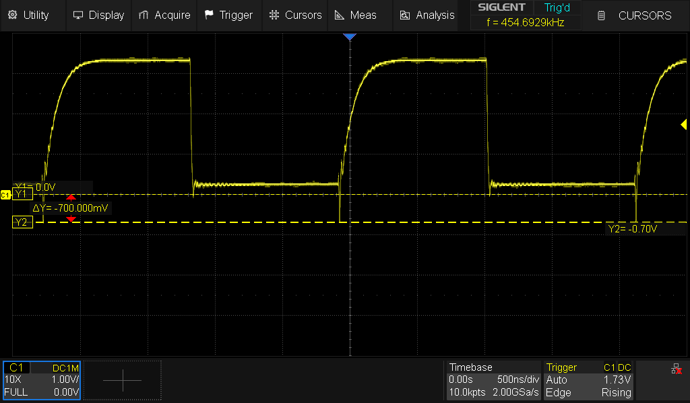

# I2C FPGA Implementation & Experiments

## Tristate (Three-state) buffer

Implementing a tristate buffer using a FET (N-channel MOSFET)

Just a demo of implementing a tristate buffer. One buffer represents one communication line. In the full I2C bus implementation, there shuold be two of such buffers for the SDA & SCL lines respsectively.

<div><figure><figcaption></figcaption></figure> <figure><figcaption></figcaption></figure> <figure><figcaption></figcaption></figure></div>


Video Demo


<figure><figcaption><p>P147 and P145 is used (MOSFET control &#x26; sensing)</p></figcaption></figure>

### Verilog Code

<pre class="language-verilog"><code class="lang-verilog"><strong>module lab0 (
</strong>    input  wire clk,      // Clock signal
    input  wire rst,      // Asynchronous reset (active high)
    input  wire sig,      // External signal line (from the tri-state buffer node)
    input  wire hold,     // Control input: 1 = hold the line down via FET, 0 = let it float
    output reg  line_val, // Sampled value from the signal line
    output reg  fet_out   // Control output to the FET gate
);

always @(posedge clk or posedge rst) begin
    if (rst) begin
        line_val &#x3C;= 1'b0; // Initialize sampled line value on reset
        fet_out  &#x3C;= 1'b0; // Initialize FET control (FET off) on reset
    end else begin
        // Sample the external signal
        line_val &#x3C;= sig;
        // Directly drive the FET control output using the hold input
        fet_out  &#x3C;= hold;
    end
end

endmodule
</code></pre>

### Contraints

```xml
<design name="lab0">
  <port name="clk" position="P77"/>
  <port name="rst" position="P151"/>
  <port name="sig" position="P145"/>
  <port name="hold" position="P150"/>
  <port name="line_val" position="P168"/>
  <port name="fet_out" position="P147"/>
</design>
```

***

## Tristate buffer logic + clock generator (with clock stretching)

***

## Operating at high frequencies / clock rates

There are two ways to drive the clock on the FDE FPGA:

1. Using the SMIMS driver (user defined clock from the USB serial interface)
2. Using the built in 30MHz crystal (that also drives the SMIMS USB interface chip)

When using the SMIMS driver, the waveform received on the computer looks fine, but through the oscilloscope, it looks very distorted. After frequencies higher than 100Hz, it almost looks unusable. At first I thought it was a problem with my Verilog code or the MOSFET circuit, or even my probe. After looking the module up the internal 30MHz clock, the generated signals were free of weird artifacts. Therefore, we can conclude that using the built-in 30MHz oscillator must be the correct way to go, but there is a catch: **how to manage the exchange of data between the FGPA, running independently at a higher frequency, and the SMIMS USB driver module, also running at a different (slower) clock rate.**

> After doing some research online, I concluded that a decently sized buffer is needed and many forums point to a "**asynchronous FIFO buffer**".\
> \
> I have not yet looked into the details of such an implementation, but the idea is simple: we can have two buffers, a data in buffer & a data out buffer.
>
> * **Data-in buffer**: responsible for storing the bits read from the data line, stores them in chucks of bytes in the buffer
>   * The PC and SMIMS module can then asynchronously read from that buffer (with many data lines & maybe multiplexing to increase throughput to compensate for the big difference in clock speed and signal transmission rate)
> * **Data-out buffer**: If we which to send data from our end, it would be nice to send all the data in one continuous chunk (which would not be possible in this proposed setup)
>   * The client will then put all the data it wants to send in the data out buffer and once the buffer is ready (or full?), it would signal to the I2C module that its ready for transmitting

Let's worry about the async FIFO later. The following are screenshots of some waveforms captured from the generated SCL signal.

<figure><figcaption></figcaption></figure>

From the previous image, we can observe a TTL high of 3.3v at a frequency of around 454KHz. This is a decent speed for the I2C protocol and the waveforms look decent. Seems like my implementation no problems with low-to-high timings. One observation that can be made is the undershooting that occurs at the beginning of the rise and at the end of the high state.


Without a resistor in series limiting the current (to dampen the effects of undershooting), we can observe a undershoot of around -1.4V for 10.0ns. The period is very brief and I doubt that it would damage the circuitry (I hope... not an expert in this) or give false logic readings, but -1.4V seems a little excessive. If the magnitude was lower, I would sleep a lot better.

<figure><figcaption></figcaption></figure>

Placing a 20-100 ohm resistor in series does dampen the undershoot. Instead of seeing -1.4V, the value hovers around -700mV on the lowest peak. The undershoot on the falling-edge is almost completely resolved.

<div data-full-width="true"><figure><figcaption><p>Without series resistor</p></figcaption></figure> <figure><figcaption><p>With a series resistor (150 Ohm)</p></figcaption></figure></div>

Note that adding the resistor in series also brings up the TTL low threshold, I am not sure if this would cause problems down the road. I might have to be wise about choosing a good value for this resistor in series. These two graphs show how the signal looks like after adding the resistor:

<div data-full-width="true"><figure><figcaption><p>Rising edge @454Khz w/ series resistor</p></figcaption></figure> <figure><figcaption><p>Falling edge @454Khz w/ series resistor</p></figcaption></figure></div>

### New concepts

* Overshoot
* Undershoot
* Reverse voltage
* Driving a MOSFET at high frequencies (be careful of too high current flow, causing overshoot or undershoot, and can potentially damage hardware too)

> I also learned from another student that the probes for the oscilloscope might introduce some inductance and capacitance to the measurements causing second order effects in the readings. There might be artifacts caused by the probe, not the signal itself. I am not an electrical engineering students so there is nothing I can do to analyze this (so far...).\
> \
> Also, this is currently implemented on a breadboard, so that might also introduce some interference causing these artifacts. It is a extremely cheap breadboard.

### References

* [https://www.ti.com/lit/an/slyt770/slyt770.pdf](https://www.ti.com/lit/an/slyt770/slyt770.pdf)
* [https://e2e.ti.com/support/interface-group/interface/f/interface-forum/1188256/pca9555-i2c-sda-scl-undershoot-impact](https://e2e.ti.com/support/interface-group/interface/f/interface-forum/1188256/pca9555-i2c-sda-scl-undershoot-impact)
* [https://blog.csdn.net/wallace89/article/details/121362747](https://blog.csdn.net/wallace89/article/details/121362747)
* [https://www.edn.com/design-calculations-for-robust-i2c-communications/](https://www.edn.com/design-calculations-for-robust-i2c-communications/)
* [https://www.nxp.com/docs/en/user-guide/UM10204.pdf/](https://www.nxp.com/docs/en/user-guide/UM10204.pdf)
* [https://www.edn.com/design/analog/4371297/Design-calculations-for-robust-I2C-communications](https://www.edn.com/design/analog/4371297/Design-calculations-for-robust-I2C-communications)
* [https://www.nxp.com/documents/other/design\_con\_2003\_tecforum\_i2c\_bus\_overview.pdf](https://www.nxp.com/documents/other/design_con_2003_tecforum_i2c_bus_overview.pdf)
* [http://www.analog.com/media/en/technical-documentation/product-selector-card/i2Cb.pdf](http://www.analog.com/media/en/technical-documentation/product-selector-card/i2Cb.pdf)
* [https://electronics.stackexchange.com/questions/292032/noises-on-the-i2c-bus](https://electronics.stackexchange.com/questions/292032/noises-on-the-i2c-bus)

***

## Experimenting with the fully functional BIT module

***

## Asynchronous FIFO

For the purpose of buli

